## 1. 서비스 주요 기능 (우선순위별)

```mermaid
%%{init: {
  "theme": "base",
  "themeVariables": {
    "primaryColor": "#0A1628",
    "primaryTextColor": "#ffffff",
    "lineColor": "#00D9A3",
    "fontSize": "14px"
  },
  "flowchart": { "nodeSpacing": 40, "rankSpacing": 80 }
}}%%
flowchart LR
    subgraph CORE["🥇 1순위 - 핵심 기능"]
        F1["🎭 멀티 AI 면접 시스템\n(3인 면접관 + 동적 페르소나)"]
        F2["⚡ 실시간 스트리밍 면접\n(STT → LLM → TTS, <2.5초)"]
        F3["🔍 RAG 기반 맞춤형 질문 생성\n(이력서/포트폴리오/JD/회사 문서)"]
    end

    subgraph ANALYSIS["🥈 2순위 - 분석/평가"]
        A1["📊 8축 역량 평가\n+ 5대 평가 카테고리"]
        A2["🎙️ 음성 분석\n(WPM/추임새/침묵/자신감)"]
    end

    subgraph EXTRA["🥉 3순위 - 부가 기능"]
        E1["💰 크레딧 시스템\n(획득/차감/등급)"]
        E2["📈 대시보드 & 리포트\n(히스토리/분석/추천)"]
    end

    CORE --> ANALYSIS --> EXTRA

    style CORE fill:#00D9A3,stroke:#00D9A3,color:#0A1628
    style ANALYSIS fill:#6C63FF,stroke:#6C63FF,color:#ffffff
    style EXTRA fill:#A8C5FF,stroke:#A8C5FF,color:#0A1628
```



---

## 2. 사용자 흐름 (User Flow)

```mermaid
%%{init: {
  "theme": "base",
  "themeVariables": {
    "primaryColor": "#0A1628",
    "primaryTextColor": "#ffffff",
    "lineColor": "#00D9A3",
    "fontSize": "14px"
  },
  "flowchart": { "nodeSpacing": 60, "rankSpacing": 80 }
}}%%
flowchart LR
    START["🚀 시작"]
    LOGIN["🔐 로그인/회원가입\n(Google/Kakao/Naver/Email)"]
    DASH["📊 대시보드 홈"]
    HISTORY["📜 히스토리"]
    START_INT["🎤 새 면접 시작"]
    SETTINGS["⚙️ 설정"]

    SETUP["⚙️ 면접 설정\n직무·산업·난이도·문서·JD·타이머"]
    INTERVIEW["🎭 면접 진행 루프\n(최대 10턴, 3인 면접관)"]
    END["🛑 면접 종료\n8축 평가 + 합격/보류/불합격"]
    REPORT["📈 결과 리포트\n점수·음성분석·추천"]

    START --> LOGIN --> DASH
    DASH --> HISTORY
    DASH --> START_INT
    DASH --> SETTINGS
    START_INT --> SETUP --> INTERVIEW --> END --> REPORT

    style START fill:#00D9A3,stroke:#00D9A3,color:#0A1628
    style LOGIN fill:#A8C5FF,stroke:#0A1628,color:#0A1628
    style DASH fill:#F59E0B,stroke:#F59E0B,color:#ffffff
    style HISTORY fill:#6C63FF,stroke:#6C63FF,color:#ffffff
    style START_INT fill:#6C63FF,stroke:#6C63FF,color:#ffffff
    style SETTINGS fill:#6C63FF,stroke:#6C63FF,color:#ffffff
    style SETUP fill:#0A1628,stroke:#00D9A3,color:#00D9A3
    style INTERVIEW fill:#0A1628,stroke:#6C63FF,color:#6C63FF
    style END fill:#FF6B9D,stroke:#FF6B9D,color:#ffffff
    style REPORT fill:#00D9A3,stroke:#00D9A3,color:#0A1628
```



---

## 3. 서비스 아키텍처 (Service Architecture)

```mermaid
%%{init: {
  "theme": "base",
  "themeVariables": {
    "primaryColor": "#0A1628",
    "primaryTextColor": "#ffffff",
    "lineColor": "#00D9A3",
    "fontSize": "13px"
  },
  "flowchart": { "nodeSpacing": 40, "rankSpacing": 80, "useMaxWidth": true }
}}%%
flowchart LR
    subgraph CLIENT["👤 Client\nWeb / iOS / Android"]
        U1["브라우저\n(Chrome/Safari)"]
        U2["모바일 앱\n(Capacitor WebView)"]
    end

    subgraph FRONT["🎨 Frontend\nNext.js 16 + React 18"]
        F1["App Router\n(페이지/레이아웃)"]
        F2["UI: Tailwind + Radix UI\nShadcn 기반 컴포넌트"]
        F3["State: Zustand\n폼: React Hook Form"]
    end

    subgraph BACK["⚙️ Backend\nNext.js API Routes (Vercel)"]
        B1["/api/interview\nstart/message/end/stream/analyze"]
        B2["/api/stt · /api/tts\n음성 처리"]
        B3["/api/rag\n문서 업로드/검색"]
        B4["/api/auth · /api/profile\n인증/프로필"]
        B5["/api/credit\n크레딧/리워드"]
    end

    subgraph AI["🤖 AI Layer"]
        A1["OpenAI GPT-4o\n(질문·평가·속마음·루브릭)"]
        A2["OpenAI Whisper\n(STT)"]
        A3["OpenAI TTS-1 / ElevenLabs\n(TTS, 스트리밍)"]
        A4["Embeddings\ntext-embedding-3-small"]
        A5["Cohere Rerank\n(선택적 Reranking)"]
        A6["LlamaParse / PDF Parser\n문서 파싱"]
    end

    subgraph DB["🗄️ Database\nSupabase (PostgreSQL)"]
        D1["profiles / credits / referral"]
        D2["documents\n(이력서/포트폴리오/JD/회사문서)"]
        D3["interview_sessions / messages"]
        D4["interview_results\n+ emotion_analyses\n+ speech_analytics"]
        D5["questions\n(질문 은행)"]
        D6["credit_transactions / daily_login_log"]
    end

    subgraph INFRA["☁️ Infra & Observability"]
        I1["Vercel Hosting"]
        I2["Supabase Auth & Storage"]
        I3["Sentry\n에러/성능 모니터링"]
        I4["Clarity\n행동 분석"]
    end

    CLIENT --> FRONT --> BACK --> AI --> DB
    BACK --> INFRA

    style CLIENT fill:#A8C5FF,stroke:#A8C5FF,color:#0A1628
    style FRONT fill:#00D9A3,stroke:#00D9A3,color:#0A1628
    style BACK fill:#6C63FF,stroke:#6C63FF,color:#ffffff
    style AI fill:#FF6B9D,stroke:#FF6B9D,color:#ffffff
    style DB fill:#0A1628,stroke:#00D9A3,color:#ffffff
    style INFRA fill:#1a2744,stroke:#A8C5FF,color:#ffffff
```



---

## 4. 데이터 모델 & ERD

```mermaid
%%{init: {
  "theme": "base",
  "themeVariables": {
    "primaryColor": "#0A1628",
    "lineColor": "#00D9A3",
    "fontSize": "12px"
  },
  "flowchart": { "nodeSpacing": 40, "rankSpacing": 60 }
}}%%
flowchart TB
    P[\"profiles\nid (PK)\nname\njob_type\nindustry\ntier\"]
    CR[\"credits\nuser_id (PK, FK)\ncurrent_credits\ntotal_earned\ntotal_used\"]
    RF[\"referral\nuser_id (PK, FK)\nreferral_code\nreferred_by\"]

    DOC[\"documents\nid (PK)\nuser_id (FK)\ntype\nfilename\ncontent\nembedding\nmetadata\"]

    SESS[\"interview_sessions\nid (PK)\nuser_id (FK)\njob_type\nindustry\ndifficulty\nresume_doc_id (FK)\nstatus\nturn_count\nmax_turns\njd_text\"]

    MSG[\"messages\nid (PK)\nsession_id (FK)\nrole\ninterviewer_id\ncontent\nstructured_response\naudio_url\"]

    RES[\"interview_results\nid (PK)\nsession_id (FK)\nuser_id (FK)\noverall_score\npass_status\ncompetency_scores\"]
    EMO[\"emotion_analyses\nid (PK)\nresult_id (FK)\naverage_scores\ntimeline\"]
    SP[\"speech_analytics\nid (PK)\nresult_id (FK)\nwords_per_min\nfiller_words\nsilence_patterns\"]

    QT[\"questions\nid (PK)\ncategory\njob_type\nindustry\ndifficulty\nquestion_text\"]

    CT[\"credit_transactions\nid (PK)\nuser_id (FK)\namount\nreason\nbalance_after\"]
    DL[\"daily_login_log\nid (PK)\nuser_id (FK)\nrewarded_at\nreward_date\"]

    P --> CR
    P --> RF
    P --> DOC
    P --> SESS
    SESS --> MSG
    SESS --> RES
    RES --> EMO
    RES --> SP
    P --> CT
    P --> DL
    QT -. 질문 참조 .- SESS

    style P fill:#6C63FF,stroke:#6C63FF,color:#ffffff
    style CR fill:#00D9A3,stroke:#00D9A3,color:#0A1628
    style RF fill:#00D9A3,stroke:#00D9A3,color:#0A1628
    style DOC fill:#0A1628,stroke:#A8C5FF,color:#A8C5FF
    style SESS fill:#FF6B9D,stroke:#FF6B9D,color:#ffffff
    style MSG fill:#F59E0B,stroke:#F59E0B,color:#ffffff
    style RES fill:#00D9A3,stroke:#00D9A3,color:#0A1628
    style EMO fill:#A8C5FF,stroke:#A8C5FF,color:#0A1628
    style SP fill:#A8C5FF,stroke:#A8C5FF,color:#0A1628
    style QT fill:#1a2744,stroke:#6C63FF,color:#ffffff
    style CT fill:#10B981,stroke:#10B981,color:#ffffff
    style DL fill:#10B981,stroke:#10B981,color:#ffffff
```

---

## 5. 데이터 흐름 (Data Flow)


---

## 6. 시스템 프롬프트 구성

```mermaid
%%{init: {
  "theme": "base",
  "themeVariables": {
    "primaryColor": "#0A1628",
    "primaryTextColor": "#ffffff",
    "lineColor": "#00D9A3",
    "fontSize": "12px"
  },
  "flowchart": { "nodeSpacing": 40, "rankSpacing": 70 }
}}%%
flowchart TB
    subgraph BASE["🎭 기본 페르소나"]
        B1["역할/직책\n(채용담당자/HR/현직자)"]
        B2["MBTI 타입\n(16가지)"]
        B3["이름/호칭"]
    end

    subgraph ROLE["💼 역할별 설정"]
        R1["채용담당자:\n직무 전문성/의사결정"]
        R2["HR:\n문화 적합성/커뮤니케이션"]
        R3["현직자:\n협업/학습 태도"]
    end

    subgraph CTX["📄 컨텍스트 주입"]
        C1["지원자 정보\n(RAG: 이력서/포트폴리오/자소서)"]
        C2["채용공고 JD\n(사용자 입력 텍스트)"]
        C3["이전 면접 키워드\n+ 난이도 설정"]
    end

    subgraph RULE["📋 행동 지침"]
        U1["질문 반복 금지\n답변 에코 금지"]
        U2["JSON 구조 출력\n(Structured Output)"]
        U3["STAR/PREP 구조 평가\n+ 꼬리질문 로직"]
    end

    subgraph OUT["🧾 출력 스키마"]
        O1["question"]
        O2["evaluation\n(relevance/clarity/depth)"]
        O3["inner_thought"]
        O4["follow_up_intent\n+ suggested_follow_up"]
    end

    BASE --> ROLE --> CTX --> RULE --> OUT

    style BASE fill:#6C63FF,stroke:#6C63FF,color:#ffffff
    style ROLE fill:#FF6B9D,stroke:#FF6B9D,color:#ffffff
    style CTX fill:#F59E0B,stroke:#F59E0B,color:#ffffff
    style RULE fill:#0A1628,stroke:#00D9A3,color:#00D9A3
    style OUT fill:#00D9A3,stroke:#00D9A3,color:#0A1628
```



---

## 7. 평가 루브릭 (5대 카테고리 → 8축 역량)

```mermaid
%%{init: {
  "theme": "base",
  "themeVariables": {
    "primaryColor": "#0A1628",
    "primaryTextColor": "#ffffff",
    "lineColor": "#00D9A3",
    "fontSize": "12px"
  },
  "flowchart": { "nodeSpacing": 40, "rankSpacing": 60 }
}}%%
flowchart LR
    subgraph CORE["📋 5대 평가 카테고리 (1-5점)"]
        C1["논리적 구조\n20%"]
        C2["직무 전문성\n30%"]
        C3["태도/커뮤니케이션\n20%"]
        C4["회사 적합성\n15%"]
        C5["성장 잠재력\n15%"]
    end

    subgraph COMP["📊 8축 역량 (0-100점)"]
        X1["행동 역량"]
        X2["명확성"]
        X3["이해력"]
        X4["커뮤니케이션"]
        X5["논리적 사고"]
        X6["문제 해결"]
        X7["리더십"]
        X8["적응력"]
    end

    TOTAL["🎯 종합 점수\n(가중 평균 × 20)\n70↑ 합격 / 50-69 보류 / 50↓ 불합격"]

    C1 --> X2
    C1 --> X5
    C1 --> X4

    C2 --> X6
    C2 --> X3
    C2 --> X5
    C2 --> X8

    C3 --> X4
    C3 --> X1
    C3 --> X7
    C3 --> X8

    C4 --> X1
    C4 --> X3
    C4 --> X8

    C5 --> X8
    C5 --> X1
    C5 --> X7
    C5 --> X6

    COMP --> TOTAL

    style CORE fill:#0A1628,stroke:#6C63FF,color:#6C63FF
    style COMP fill:#1a2744,stroke:#00D9A3,color:#ffffff
    style TOTAL fill:#00D9A3,stroke:#00D9A3,color:#0A1628
```



---

## 8. 기술 스택 및 성능 지표

```mermaid
%%{init: {
  "theme": "base",
  "themeVariables": {
    "primaryColor": "#0A1628",
    "primaryTextColor": "#ffffff",
    "lineColor": "#00D9A3",
    "fontSize": "12px"
  },
  "flowchart": { "nodeSpacing": 40, "rankSpacing": 70 }
}}%%
flowchart TB
    subgraph FE["🎨 Frontend"]
        FE1["Next.js 16\nApp Router"]
        FE2["React 18\nTypeScript 5"]
        FE3["Tailwind CSS\nRadix UI / Shadcn"]
        FE4["Zustand\nReact Hook Form"]
        FE5["Capacitor\n(iOS/Android)"]
    end

    subgraph BE["⚙️ Backend"]
        BE1["Next.js API Routes\n(Vercel Functions)"]
        BE2["SSE Streaming\n(면접/분석)"]
    end

    subgraph AI["🤖 AI / ML"]
        AI1["GPT-4o\n(질문/평가/속마음/RAG)"]
        AI2["Whisper\n(STT)"]
        AI3["TTS-1 / ElevenLabs\n(TTS)"]
        AI4["Embeddings\ntext-embedding-3-small"]
        AI5["Cohere Rerank\n(옵션)"]
    end

    subgraph DB["🗄️ Database"]
        DB1["Supabase\nPostgreSQL"]
        DB2["pgvector\n벡터 검색"]
        DB3["pg_trgm\n텍스트 검색"]
        DB4["RLS 보안\nAuth 연동"]
    end

    subgraph OBS["📈 Infra / DevOps"]
        O1["Vercel\n배포/호스팅"]
        O2["Sentry\n에러/성능"]
        O3["Clarity\n사용자 행동"]
        O4["ESLint/Prettier\nJest/pnpm"]
    end

    subgraph PERF["⏱️ 핵심 성능 지표"]
        P1["STT: 500-800ms"]
        P2["LLM: 800-1200ms"]
        P3["TTS 첫 청크: 300-500ms"]
        P4["E2E 스트리밍: ~1.6-2.5s"]
        P5["소형 PDF 처리: 2-3s\n대형 PDF: 8-12s"]
    end

    FE --> BE --> AI --> DB --> OBS
    AI --> PERF

    style FE fill:#00D9A3,stroke:#00D9A3,color:#0A1628
    style BE fill:#6C63FF,stroke:#6C63FF,color:#ffffff
    style AI fill:#FF6B9D,stroke:#FF6B9D,color:#ffffff
    style DB fill:#0A1628,stroke:#00D9A3,color:#ffffff
    style OBS fill:#1a2744,stroke:#A8C5FF,color:#ffffff
    style PERF fill:#F59E0B,stroke:#F59E0B,color:#ffffff
```




